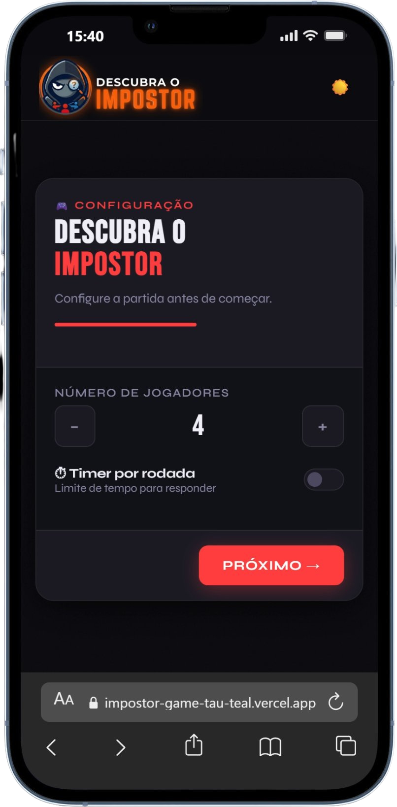
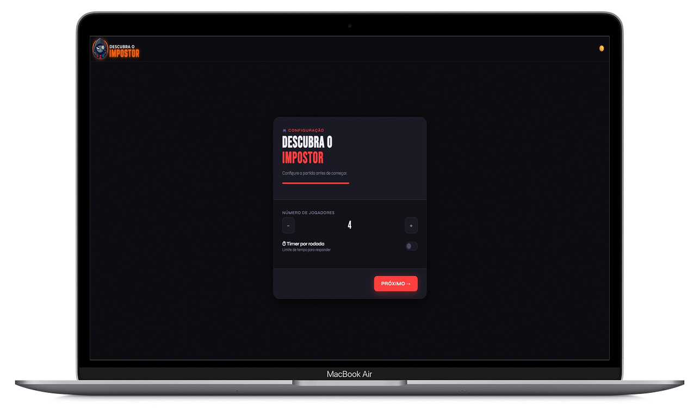
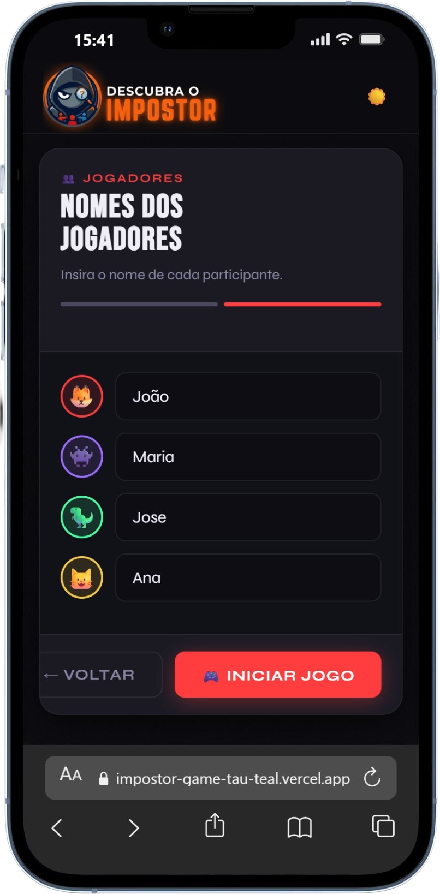
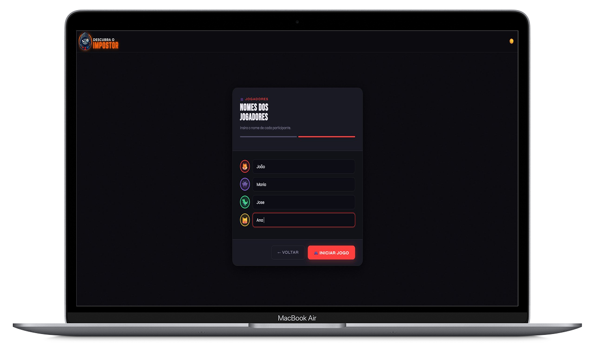
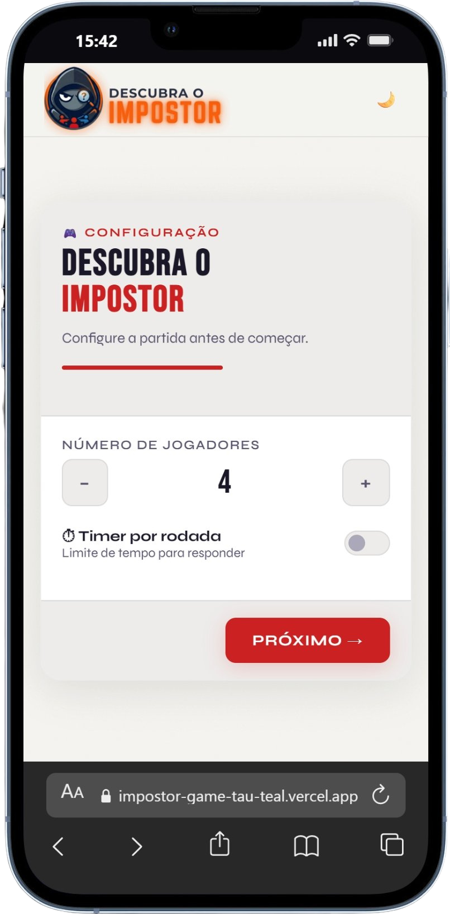
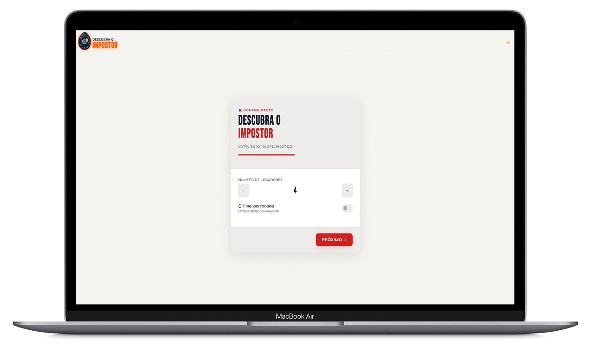
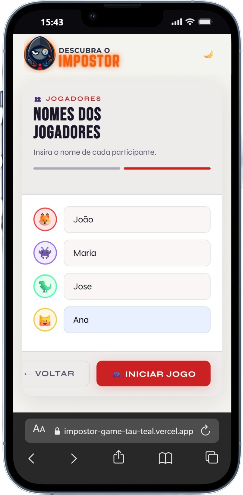
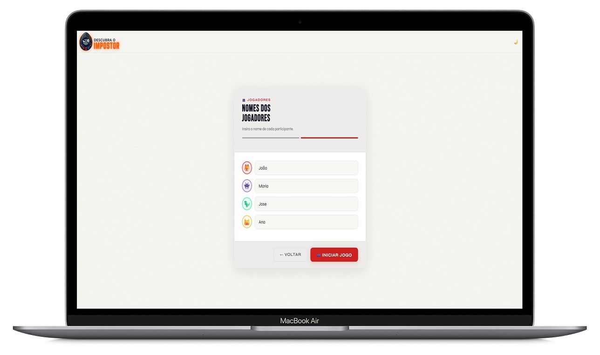

<p align="center">
  
</p>

<h1 align="center">Descubra o Impostor</h1>

<p align="center">
  Um jogo multiplayer local de dedução, blefe e criatividade desenvolvido com React.
</p>

<p align="center">
  
  
  
  
  
</p>

---

## 📌 Sobre o projeto

**Descubra o Impostor** é um jogo multiplayer local desenvolvido em React, criado para ser jogado com amigos usando o mesmo dispositivo.

Durante cada rodada, a maioria dos jogadores recebe a mesma pergunta — mas um deles recebe uma pergunta parecida, porém diferente. Esse jogador é o **impostor**.

O desafio dos jogadores normais é analisar as respostas e descobrir quem está tentando se misturar ao grupo. Já o impostor precisa responder de forma convincente para não ser descoberto.

Ideal para encontros, festas ou qualquer momento que peça um jogo de dedução, blefe e criatividade.

---

## 📸 Screenshots

<div align="center">

### 🌑 Tema Escuro

|                           Mobile                            |                           Desktop                            |
| :---------------------------------------------------------: | :----------------------------------------------------------: |
|    |    |
|  |  |

### ☀️ Tema Claro

|                            Mobile                            |                            Desktop                            |
| :----------------------------------------------------------: | :-----------------------------------------------------------: |
|    |    |
|  |  |

## </div>

## 🎯 Objetivo do jogo

**Jogadores normais** — observar as respostas exibidas na rodada e identificar quem recebeu uma pergunta diferente.

**Impostor** — disfarçar sua resposta e parecer que recebeu a mesma pergunta dos demais.

---

## 🕹️ Como funciona

1. Os jogadores definem a quantidade de participantes e informam seus nomes
2. O jogo sorteia automaticamente quem será o impostor e qual pergunta será usada
3. Cada jogador visualiza sua pergunta individualmente na tela
4. Todos respondem sem revelar qual pergunta receberam
5. As respostas aparecem embaralhadas e de forma anônima
6. Os jogadores votam em quem acreditam ser o impostor
7. O resultado final revela o impostor e exibe os votos recebidos

---

## ✨ Funcionalidades

- Sorteio automático do impostor e das perguntas a cada rodada
- Tela individual por jogador para visualizar a pergunta e enviar a resposta
- Respostas exibidas de forma anônima e embaralhada
- Sistema de votação entre os jogadores
- Tela de resultado com revelação do impostor e placar de votos
- Timer opcional por rodada
- Tema escuro como padrão, com suporte a tema claro
- Interface responsiva

---

## 🚀 Como rodar localmente

**Pré-requisitos:** Node.js 18+

```bash
git clone https://github.com/VitorNorton/impostor-game
cd impostor-game
npm install
npm start
```

Acesse [http://localhost:3000](http://localhost:3000) no navegador.

---

## 🐳 Rodando com Docker

```bash
docker build -t impostor-game .
docker run -p 80:80 impostor-game
```

Acesse [http://localhost](http://localhost) no navegador.

---

## 🗂️ Estrutura do projeto

```
src/
├── components/
│   ├── SetupGame.jsx       # Configuração de jogadores
│   ├── PlayerScreen.jsx    # Tela individual de pergunta
│   ├── AnswerInput.jsx     # Campo de resposta
│   ├── ResultsScreen.jsx   # Exibição anônima das respostas
│   ├── VotingScreen.jsx    # Sistema de votação
│   ├── FinalScreen.jsx     # Resultado final
│   └── TopBar.jsx          # Barra de navegação
├── context/
│   └── GameContext.jsx     # Estado global do jogo
├── data/
│   └── perguntas.js        # Banco de perguntas
├── hooks/
│   └── useTimer.js         # Hook do timer
└── utils/
    └── gameUtils.js        # Funções auxiliares
```

---

👨‍💻 Desenvolvedores
|                  |                                                |
| ---------------- | ---------------------------------------------- |
| Vitor Norton | @VitorNorton |
| Vitor Braga  | @Randons1
---

## 📄 Licença

Este projeto está sob a licença MIT.
